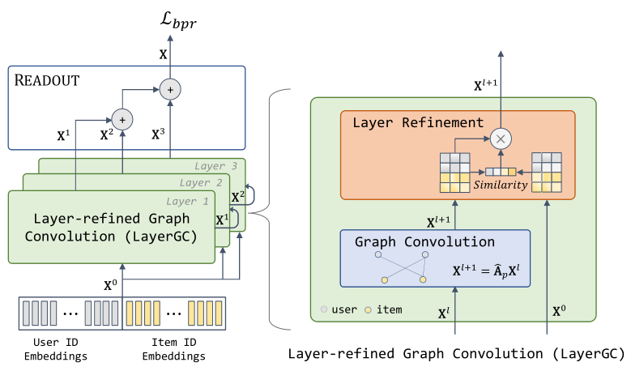

# ImRec:<ins>Im</ins>plicit feedback based <ins>Rec</ins>ommendation framework  

_We opensource the framework and hope it could benefit the community. Please open an issue if you have difficulty in reproducing the results._
- :twisted_rightwards_arrows: All my models (_LayerGCN/SelfCF_) are further integrated into the unified [MMRec](https://github.com/enoche/MMRec) framework.

## Features

- **Aligning recommendation to Industry**
  - Global time splitting with timestamp (_Same raw source data, same results! Previous random 
    splittings suffer from **data leakage** and do not hold this property._)
  - Strictly predict future interactions.
  
- **Reproducibility Ensured**: Same seed, same server(GPU), same performance.  

- **Supporting various supervised tasks**
  - Supervised with sampled negatives by a sampling strategy
  - Supervised with all positives and negatives (_All unobserved are negatives_)
  - Self-supervised with observed interactions only

- **Unified and order-invariant grid search (GS) entry**
  - One entry for grid search and per-run of model
  - Reproduce same results no matter what order of hyper-parameters in GS
  - Results are summarized to ease your manual comparison after GS

- **Personal maintenance, towards bug-free**  
  - Framework consistency is ensured

## Supported models (_More to expect_):
\- _All source codes are under `models` dir_  
\- _You may post an issue for the model you expected an integration, I'll handle it if the source code is available._  

| **Model**       | **Paper (PDF)**                                                                                             | **Conference/Journal** | **Code**    |
|------------------|--------------------------------------------------------------------------------------------------------|------------------------|-------------|
| BPR              | [BPR: Bayesian Personalized Ranking from Implicit Feedback](https://arxiv.org/ftp/arxiv/papers/1205/1205.2618.pdf)                                              | UAI'09                 | bpr.py      |
| MultiVAE         | [Variational Autoencoders for Collaborative Filtering](https://arxiv.org/pdf/1802.05814.pdf)                                                   | WWW'18                 | multivae.py |
| NGCF             | [Neural Graph Collaborative Filtering](https://arxiv.org/pdf/1905.08108.pdf)                                                                   | SIGIR'19               | ngcf.py     |
| EHCF             | [Efficient Heterogeneous Collaborative Filtering without Negative Sampling for Recommendation](https://ojs.aaai.org/index.php/AAAI/article/download/5329/5185)            | AAAI'20                | ehcf.py     |
| LR-GCCF          | [Revisiting Graph based Collaborative Filtering: A Linear Residual Graph Convolutional Network Approach](https://arxiv.org/pdf/2001.10167.pdf) | AAAI'20                | lrgccf.py   |
| LightGCN         | [LightGCN: Simplifying and Powering Graph Convolution Network for Recommendation](https://arxiv.org/pdf/2002.02126.pdf)                        | SIGIR'20               | lightgcn.py |
| BUIR             | [Bootstrapping User and Item Representations for One-Class Collaborative Filtering](https://arxiv.org/pdf/2105.06323.pdf)                      | SIGIR'21               | buir*.py    |
| UltraGCN         | [UltraGCN: Ultra Simplification of Graph Convolutional Networks for Recommendation](https://arxiv.org/pdf/2110.15114.pdf)                          | CIKM'21                | ultragcn.py |
| IMP-GCN          | [Interest-aware Message-Passing GCN for Recommendation](https://arxiv.org/pdf/2102.10044.pdf)                                                      | WWW'21                 | imp_gcn.py |
|                  |                                                                                                        |                        |             |
| **Newly added**  |                                                                                                        |                        |             |
| :fire: LayerGCN         | [Layer-refined Graph Convolutional Networks for Recommendation](https://arxiv.org/pdf/2207.11088.pdf)                                          | ICDE'23                  | layergcn.py |
| SelfCF(ed/he/ep) | [SelfCF: A Simple Framework for Self-supervised Collaborative Filtering](https://arxiv.org/pdf/2107.03019.pdf)                                 | ACM TORS'23                 | selfcf*.py  |


## LayerGCN: Layer-refined Graph Convolutional Networks for Recommendation

<p>

</p>

## Data  
Download from Google Drive: [Amazon-Vedio-Games/Food etc.](https://drive.google.com/drive/folders/1WqRAeoWWGdZplYkjS4640V7v0urNiTXg?usp=sharing)    

## How to run
`python main.py -m LayerGCN -d food`

You may specify other parameters in CMD or config with `configs/model/*.yaml` and `configs/dataset/*.yaml`.

## Best hyper-parameters for reproducibility
We report the best hyper-parameters of LayerGCN to reproduce the results in Table II of our paper as:  

| Datasets | dropout | reg_weight |
|----------|---------|------------|
| MOOC     | 0.1     | 1e-03      |
| Games    | 0.2     | 1e-03      |
| Food     | 0.1     | 1e-02      |
| Yelp     | 0.2     | 1e-03      |

## Citing if this repo. helps:

```
@inproceedings{zhou2023layer,
  title={Layer-refined graph convolutional networks for recommendation},
  author={Zhou, Xin and Lin, Donghui and Liu, Yong and Miao, Chunyan},
  booktitle={2023 IEEE 39th International Conference on Data Engineering (ICDE)},
  pages={1247--1259},
  year={2023},
  organization={IEEE}
}


@article{zhou2023selfcf,
  author = {Zhou, Xin and Sun, Aixin and Liu, Yong and Zhang, Jie and Miao, Chunyan},
  title = {SelfCF: A Simple Framework for Self-Supervised Collaborative Filtering},
  year = {2023},
  journal = {ACM Trans. Recomm. Syst.},
  publisher = {Association for Computing Machinery},
}
```

* This repo. simplifies [Recbole](https://github.com/RUCAIBox/RecBole) to align with industry settings.

